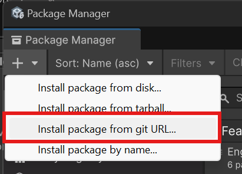
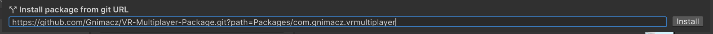

# How to install
For more detailed instructions please check out the wiki.

## Installation through the package manager
The easiest way to install the package is by opening the unity package manager and pasting
```
https://github.com/Gnimacz/VR-Multiplayer-Package.git?path=Packages/com.gnimacz.vrmultiplayer
```
into the unity package manager and it will install itself.

> [!Warning]
> Please make sure you have the text mesh pro essentials installed before opening the example that is included in the package

> [!NOTE]
> After installing, if you are not using the VR template project. Please import the starter assets sample from the XR interaction toolkit package

---

---
I would highly recommend an addon like [Parrelsync](https://github.com/VeriorPies/ParrelSync) to help with testing multiplayer functionality. **BE AWARE** that this may cause unexpected results when connecting clients that are on the same device.
